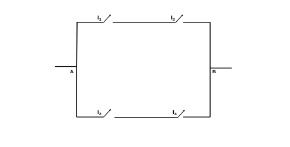
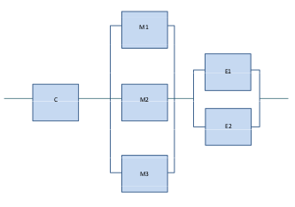
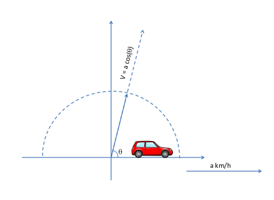

```{r setup, include=FALSE}
knitr::opts_chunk$set(echo = TRUE, message = FALSE, warning = FALSE)
```

# Chapter 1. Descriptive statistics 

## Problem 1

An study about nutrition and health requested information of the food. Specifically, the amount of proteins(gr), carbohydrates(gr), fats(gr), and sodium(mgr) in their products. 

A list of the products is presented below: 

```{r echo = FALSE}
# vectors of nutritional information of the products
product <- c('A','B','C','D','E','F','G','H','I','J','K','L','M','N','O')
proteins <- c(29,15,11,16,18,15,52,24,18,3,1,2,11,11,26)
carbohydrates <- c(51,24,14,39,64,34,56,63,26,28,11,31,50,60,39)
fats <- c(32,13,8,24,46,23,46,54,20,10,8,19,11,9,31)
sodium <- c(909,303,79,836,735,709,2285, 1915, 914,5,266,414,159,329,962)
# create data frame with the vectors
products.info = data.frame(product,proteins,carbohydrates,fats,sodium)
products.info
```

(a) Compute the mean, median, standard deviation, first and third quantiles for each column. 

```{r echo=TRUE}
# compute descriptive statistics
summary(products.info)
```

(b) Compute covariance and correlation matrices. 

```{r echo=TRUE}
cov.matrix <- cov(products.info[2:5])#compute covariance matrix over the columns
cor.matrix <- cor(products.info[2:5])#compute correlation matrix over the columns
cov.matrix
cor.matrix
```

## Problem 2

If the probability of rain throughout the day is 0.5, approximate the probability
of rain troughout the weekend (given that the weather forecast on saturday does not add any information of the weather forecast of sunday). Compare it with the theoretically probability. 

```{r}
prob.rain <- 0.5 # probability of rain
n <- 520 # weeks in 10 years
rainy.days <- rbinom(n, size = 2, prob=prob.rain) # number of days that have rained in 2 days
rain.in.weekends <- sapply(rainy.days,function(x) if(x>0) 1 else 0)
prob.weekend <- sum(rain.in.weekends)/n
prob.weekend
```

\[
P(A) \sim \text{Probability of raining on saturday}
\]
\[
P(B) \sim \text{Probability of raining on sundays}
\]
\[
P(R) \sim \text{Probability of raining on weekends}
\]
\[
P(R) = P(A\cup B) = P(A) + P(B) - p(A\cap B) = P(A)+P(B)-P(A)\,P(B)
\]
\[
P(R) = 0.75 , P(A) = P(B) = 1/2
\]

## Problem 3

Check the reliability of a system that have 5 components in series. Each component has a failure probability of 5%. Compare it with the theoretically reliability. 

```{r}
prob.fail <- 0.05 # probability of failure of one component
n <- 1000 # sample size
components.fails <- rbinom(n, size = 5, prob=prob.fail) # 5 components system.
system.failures <- sapply(components.fails, function(x) if(x>=1) 1 else 0)
prob.failure <- sum(system.failures)/n # probability of failure of the system
prob.failure
```

\[
P(F) \sim \text{Probability of failure of one component}
\]
\[
P(S) \sim \text{Probability of failure of the system}
\]
\[
P(S) = P(F_1\cup F_2\cup ...F_5) = 1 - P(\bar{F_1} \cap \bar{F_2}\cap...\bar{F_5}) = 1 - P(\bar{F})^5 = 1 - 0.95⁵ = 0.226 
\]

## Problem 4 

A company that has to decide whether to purchase a certain block of shares asks the opinion of three financial advisors, who will independently decide in favor of the purchase with probabilities of 0.8, 0.5 and 0.3, respectively.

(a) Determine the probability of, at least, one of them recommending the purchase. 

\[
P(B) \sim \text{Probability of at least, one of them recommending the purchase}
\]
\[
P(A) \sim \text{Probability of decide in favor of the purchase}
\]
\[
P(B) = P(A_1\cup A_2\cup A_3) = 1 - P(\bar{A_1}\cap \bar{A_2}\cap \bar{A_3}) = 1 - 0.2*0.5*0.7 = 1 - 0.07 = 0.93
\]

(b) Determine the probability of none of them recommending the purchase. 

\[
P(N) \sim \text{Probability of none of them recommending the purchase}
\]
\[
P(N) = P(\bar{A.{1}}\cap \bar{A.{2}}\cap \bar{A.{3}}) = 0.07
\]
(c) Determine the probability of two of them recommending the purchase.
\[
P(S) \sim \text{Probability of two of them recommending the purchase}
\]
\[
P(S) = P(A_{1}\cap A_{2}\cap \bar{A_{3}}) + P(\bar{A_{1}}\cap A_{2}\cap A_{3}) + 
P(A_{1}\cap \bar{A_{2}}\cap A_{3}) = 0.8*0.5*0.7 + 0.2*0.5*0.3 + 0.8*0.5*0.3 = 0.43
\]

(d) Approximate section (a) and (c)

```{r }
n <- 10000
prob.a1 <- 0.8 # a1 is advisor 1
prob.a2 <- 0.5 
prob.a3 <- 0.3
recommend.a1 <- rbinom(n, size = 1, prob=prob.a1) # a1 recommend or not
# the previous line is equivalent to:  rbern(n,prob.a1)
recommend.a2 <- rbinom(n, size = 1, prob=prob.a2)
recommend.a3 <- rbinom(n, size = 1, prob=prob.a3)
total.recommned <- recommend.a1+recommend.a2+recommend.a3
at.least.one <- sapply(total.recommned, function(x) if(x>=1) 1 else 0)
prob.at.least.one <- sum(at.least.one)/n
two <- sapply(total.recommned, function(x) if(x==2) 1 else 0)
prob.two <- sum(two)/n
prob.at.least.one
prob.two
```

## Problem 5
Consider the electrical circuit consisting of four switches, I1, I2, I3 and I4, arranged as shown in Figure 1.1. Knowing that for each switch, the state in which it is (open or closed) is independent of the state of the other switches and that the probability of being open (i.e. not allowing current to flow) is 10%. 




(a) Determine the probability that the circuit is closed, i.e. there is a connection between A and B.

\[
P(C) \sim \text{Probability that a switch is down}
\]
\[
P(CC) \sim \text{Probability that the circuit is closed}
\]
\[
P(CC) = 1 - P(\bar{C_{1}}\cap \bar{C_{3}}\cap \bar{C_{2}}\cap \bar{C_{4}}) - 4\,P(C_{1}\cap \bar{C_{3}}\cap \bar{C_{2}}\cap \bar{C_{4}}) - 4\,P(C_{1}\cap \bar{C_{3}}\cap C_{2}\cap \bar{C_{4}}) 
\]
\[
P(CC) = 1 - (0.1⁴ + 4(0.9*0.1³)+4\,(0.9²*0.1²)) = 1 - 0.0361 = 0.9639
\]

(b) Approximate (a)

```{r}
n <- 10000
prob.I <- 0.9
odd.switchs.down <- rbinom(n,size = 2, prob = prob.I)# there are 2 switches per branch
even.switchs.down <- rbinom(n,size = 2, prob = prob.I)
connections.odd <- sapply(odd.switchs.down, function(x) if(x==2) 1 else 0)
connections.even <- sapply(even.switchs.down, function(x) if(x==2) 1 else 0)
total.connections <- sapply(connections.even + connections.odd, function(x) if(x>=1) 1 else 0)
prob.closed <- sum(total.connections)/n
prob.closed
```

## Problem 6
An industrial process follows the scheme shown in Figure 1.2. According to this scheme, for a part to be manufactured correctly, it must go through three different sub-processes:
1) Pre-check (C), 2) Assembly, which may be carried out by three different types of machinery (M1, M2 or M3), and 3) Packaging, which can be done in cardboard or metal boxes (E1 or E2). Knowing that each of these six sub-processes is passed correctly (or is operative) with a probability of 95 % and that the sub-processes occur independently of each other.



(a) Determine the probability that a randomly chosen part will be manufactured correctly

\[
P(S) \sim \text{Probability of successfully manufacture one part}
\]
\[
P(S) = P(C\cap[M1\cup M2\cup M3]\cap[E1\cup E2]) = P(C)\,P(M1\cup M2\cup M3)\,P(E1\cup E2) 
\]
\[
  P(M1\cup M2\cup M3) = P(M1)+P(M2)+P(M3)-P(M1\cap M2)-P(M1\cap M3)-P(M2\cap M3)+P(M1\cap M2\cap M3) 
\]
\[
= 3\,P(M)-3\,P(M)^2+P(M)^3 = 0.9998
\]
\[
P(E1\cup E2) = P(E1)+P(E2)-P(E1)\,P(E2) = 2\,P(E)-P(E)² = 0.9975
\]
\[
P(S) = 0.95\,0.9998\,0.9975 = 0.9474
\]

(b) If subprocess E1 has ceased to be operational for a period of time, what is the probability that a part chosen at random from among the parts manufactured during that period of time has been manufactured correctly?
\[
P(S/\bar{E1}) = P(C\cap[M1\cup M2\cap M3]\cap E2) = P(C)\,P(M1\cup M2\cap M3`)\,P(E2) = 0.95\,0.9998\,0.95 = 0.9023
\]
(c) Knowing that a randomly selected part was not manufactured correctly, what is the probability that subprocess E1 was not operative at the time of its manufacture?
What is the probability that sub-process E1 was not operational at the time of its manufacture?
\[
P(\bar{E1}/\bar{S}) = \frac{P(\bar{E_1}\cap \bar{S})}{P(\bar{S})};
\]
\[
P(\bar{S}/\bar{E1}) = \frac{P(\bar{E_1}\cap \bar{S})}{P(\bar{E_1})}
\]

\[
P(\bar{E_1}\cap \bar{S}) = P(\bar{S}/\bar{E1}){P(\bar{E_1})} = 
\]
\[
 (1-P(S/\bar{E1}))(1-{P(E_1))} = (1 - 0.9023)(1-0.95) = 0.0049
\]
\[
P(\bar{E1}/\bar{S}) = \frac{0.0049}{(1-0.9474)}=0.0931
\]
(d) Approximate (a)

```{r echo=TRUE}
prob.f <- 0.95
n = 1000
component.c <- rbinom(n, size = 1, prob = prob.f)
components.m <- rbinom(n, size = 3, prob = prob.f)
num.success.m <- sapply(components.m, function(x) if(x>=1) 1 else 0)
conponents.e <- rbinom(n, size = 2, prob = prob.f)
num.succes.e <- sapply(conponents.e, function(x) if(x>=1) 1 else 0)
num.success <- sapply(component.c*num.success.m*num.succes.e, function(x) if(x>=1) 1 else 0)
prob.s <- sum(num.success)/n
prob.s
```

## Problem 7
Simulate the 5 rolls of 3 even dice. 

```{r}
# rbinom not useful when sample space is not {0,1}
# number of dice (a trick to  simulate 5 rolls)
# instead of 3 dice and two times two of them (because they all are even)
dice <- 5
sample.space <- 1:6
rolls <- sample(sample.space, size = dice, replace = TRUE)
```

## Problem 8
Knowing that the waiting time in seconds from the time an electronic message is sent until it is received is distributed according to an a.v. X with density given by f(x) =
xe^-x , x > 0, we ask:

(a) Compute his distribution function.

\[
F(x) = \int^{x}_{-\infty}\lambda \mathrm{e}^{-\lambda t}\,\mathrm{d}t = -\int^{x}_{0} -\lambda \mathrm{e}^{-\lambda t}\,\mathrm{d}t
\]

\[
-[\mathrm{e}^{-\lambda t}]_{t=0}^{t=x} = -[\mathrm{e}^{-\lambda x} - 1] = 1 -\mathrm{e}^{-\lambda x}
\]

(b) Implement a function that generates n × m values of that r.v 

```{r}
library(dplyr)
library(magrittr)

boostrap.exp <- function(n, m, lambda=1){
  samples <- matrix(nrow = n, ncol = m)
  for (i in seq(1,n)) {
    samples[i,] <- rexp(m,lambda) %>% round(digits = 2)
  }
  return(samples)
}
n = 5
m = 10
samples <- boostrap.exp(n, m)
samples[1:2,]
```

## Problem 9 
Generate 100 values of the following function: 

\[ f(n) =
  \begin{cases}
    1 - \mathrm{{e}^{(1 - \mathrm{e^{x}})}}    & \quad x > 0\\
    0  & \quad\text{ otherwise}
  \end{cases}
\]

Applying the inverse method:

\[
1 - \mathrm{e^{(1 - \mathrm{F^{(-1}(u))}}} = u
\]
\[
\mathrm{e^{(\mathrm{F^{-1}(u))}}} = 1-\mathrm{log(1-u)}
\]
\[
F^{-1}(u) = \mathrm{log(1-\mathrm{log(1-u))}}
\]
\[
\text{with } X\sim U(0,1) = F^{-1}(u)
\]

```{r echo=TRUE}
u <- runif(100)
n <- log(1 - log(1-u))
```

## Problem 10
The following code uses the inverse transform method
to generate values of a v.a. X continues and takes values in the interval (0, 3). Starting
From that code, state the distribution function of X and its density function.

```{r echo=TRUE}
n <- 10000
u <- runif(n)
X <- 2*sqrt(u)*(u<0.25) + (2*u+0.5)*(0.25<=u & u<0.75) + (3-2*sqrt(1-u))*(u>=0.75)
```

\[
X \text{ is a piecewise function. For each piece, we need to find the original function.}
\]

\[ f(n) =
  \begin{cases}
    2\sqrt u    & \quad \text{if } u < 0.25\\
    2u + 0.5   & \quad \text{if }  0.25 <=  u < 0.75\\
    3 - 2\sqrt{1-u}   & \quad \text{if }  u >= 0.75\\
  \end{cases}
\]
\[
\text{Piece 1: }0<F(X)<0.25 
\]
\[
F^{-1}(u) = 2\,\sqrt u \to u = \frac{F^{-1}(u)^2}{{4}} \to X = \frac{x^2}{{4}}
\]
\[
\text{Piece 2: }0.25<=F(X)<0.75 
\]
\[
F^{-1}(u) = 2\,u + 0.5 \to   u = \frac{F^{-1}(u) - 0.5}{{2}} \to X = \frac{x - 0.5}{{2}}
\]
\[
\text{Piece 3: }0.75<=F(X)<1
\]
\[
3 - n\, \sqrt{1-u}  = F^{-1}(u) \to   u = 1 - \bigg( \frac{3 - F^{-1}(u)}{{2}}\bigg)^2 \to 
\]
\[
X =  1 - \bigg( \frac{3 - x}{2}\bigg)^2
\]
\[ F(X) =
  \begin{cases}
    0                  & \quad \text{if } x < 0\\
    \frac{x^2}{{4}}    & \quad \text{if } x < 1\\
    \frac{x - 0.5}{{2}}  & \quad \text{if }  1 <=  x < 2\\
    1 - \bigg( \frac{3 - x}{2}\bigg)^2   & \quad \text{if }  2 <=  x < 3\\
    1 & \quad \text{if } x >= 3\\
  \end{cases}
\]


\[ f(x) =
  \begin{cases}
    \frac{x}{2}    & \quad \text{if } x < 1\\
    \frac{1}{2}  & \quad \text{if }  1 <=  x < 2\\
    \frac{3-x}{2}   & \quad \text{if }  2 <=  x < 3\\
    0 & \quad{otherwise}
  \end{cases}
\]

```{r}
# values (0,3)
n <- 1000
x <- seq(0, 3, by=0.1)
Fx <- (x^2)/4*(x<1) + ((x-0.5)/2)*(1<=x & x<2) + (1-((3-x)/2)^2)*(2<=x & x<3) + 1*(x<=3)
fx <- x/2*(x<1) + (1/2)*(1<=x & x<2) + ((3-x)/2)*(2<=x & x<3)

plot.Fx <- plot(x,Fx)

plot.fx <- plot(x,fx)

```

## Problem 11 
Given X a Rayleigh r.v of parameter \[\alpha > 0\], with density function is:

\[ f(x) =
  \begin{cases}
    \alpha x\mathrm{e^{(-\frac{\alpha}{2}x^2)}}    & \quad \text{if } x > 0\\
    0  & \quad \text{otherwise} \\
  \end{cases}
\]

Compute the distribution function and apply the inverse method: 

\[
F(x) = \int_{0}^{x}{\alpha t\mathrm{e^{-\frac{\alpha}{2}t^2}} dt} = - \int_{0}^{x}{-\alpha t\mathrm{e^{-\frac{\alpha}{2}t^2}} dt} = 
\]
\[
[\mathrm{e^{-\frac{\alpha}{2}t^2}}]_{t=0}^{t=x} = (1 - \mathrm{e^{-\frac{\alpha}{2}t^2}})
\]

\[
(1 - \mathrm{e^{-\frac{\alpha}{2}F^{-1}(x)^2}}) = u
\]
\[
\mathrm{e^{-\frac{\alpha}{2}F^{-1}(x)^2}} = 1-u
\]
\[
F^{-1}(x) = \sqrt{-\frac{2}{\alpha}\log(1-u)}
\]


(a) Generate 50 values of X with \[alpha=0.1\]
What numerical and graphical procedures could be used to see that the v.a. has been generated correctly? 

\[
\text{Compare theoretical mean and variance with obtained mean and variance. Graphically, it could be checked by a plot}
\]

```{r echo=TRUE}
n <- 1000
a <- 0.17
u <- runif(n)

x <- sqrt((-2/a)*log(1-u))
plot(u,x)

mean <- mean(x)
theoretical_mean <- sqrt(pi/(2*a))
var <- var(x)
theoretical_var <- (4 - pi)/(2*a)
```
  

## Problem 12
A vehicle is moving in a straight line in the direction of the abscissa axis and in a positive direction at a constant speed of a units. A random direction is chosen at random so that the direction forms an angle θ with the motion of the vehicle randomly chosen so that the direction forms an angle θ with the motion of the vehicle as shown in Figure 1.3. i θ se distribuye según un modelo uniforme continuo en (0, π) y se sabe que la velocidad efectiva del vehı́culo en la dirección aleatoria viene dada por la expresión
V = a cos(θ):



(a) Determine the density and the distribution function of the effective velocility.

\[ f(\theta) =
  \begin{cases}
    \frac{1}{\pi}    & \quad \text{if } \theta  [0,\pi]\\
    0  & \quad \text{otherwise} \\
  \end{cases}
\]

\[ F(v) =
  \begin{cases}
    0 & \quad \text{if } v  < a\\
    acos(\frac{x+1}{2})    & \quad \text{if } -1  < v < 1\\
    1  & \quad \text{if } v > b
  \end{cases}
\]

\[ f(v) =
  \begin{cases}
    acos(\frac{1}{\pi})    & \quad \text{if } -1  < v < 1\\
    0  & \quad \text{otherwise} \\
  \end{cases}
\]

(b) 

\[
E[V] = \int_{-1}^1{vf(v)}dv = 
\]

(c)

```{r echo=TRUE}
n <- 10000
a <- 25
theta <- runif(n,min = 0, max = pi)
u <- runif(n, min=-1, max=1)

velocity <- a*(cos(theta))
prob.15 <- sum(velocity>15)/n
```


## Problem 13
Indicate how you would simulate the value of the number e = 2.71828...

(a) Using poisson process

```{r}
lamda <- 1
n <- 1000


```

(b) Using exponential distribution

## Problem 14
In a customer service office there are two types of clients, those who make a complaint (type I clients) and those who request information (type II clients).
Of every 200 people who pass through the office, 75 make complaints and the rest request information.
It is also known that the time in minutes that each type I client spends in the office (from the time he/she enters the office to the time he/she spends in the office) is
in the office (from the time they enter to the time they leave the office, including waiting time) is distributed according to an average Exponential
On the other hand, for a type II customer, this time is distributed according to an Exponential with an average of 15 minutes.

(a) What is the probability that a customer will spend at most a quarter of an hour in the office?

\[
P[T_I \cap T_{II} < 15] = P(I)P(T_I < 15) + P(II)P(T_{II}<15) = 
\]
\[
\frac{75}{200}(1-\mathrm{e^{-\frac{15}{15}}}) + \frac{125}{200}(1-\mathrm{e^{-\frac{15}{10}}}) = 0.7225
\]

(b) If a customer has spent less than 15 minutes in the office, what is the probability that the customer has made a complaint?


(c) Approximate (a) and (b)

```{r}
n <- 1000000
lambda.I <- 0.06666 # rate of 15
lambda.II <- 0.1 # rate of 10
type.I <- 0.375
type.II <- 0.625
office <- type.I*rexp(n, lambda.I)+type.II*rexp(n,lambda.II)
a <- sum(office<15)/n

office.I <- type.I*rexp(n, lambda.I)
office.II <- type.I*rexp(n, lambda.II)
I <- sum(office.I>15)
II <- sum(office.II>15)
b <- I/(I+II)
```


## Problem 15
The lifetime of certain electronic components follows an Exponential distribution with a mean of 100 days.

(a) What is the probability that one of the above components will last more than 50 days?

\[
T \sim EXP(100)
\]
\[
P(T>50) = 1 - P(T<50) = 1 - [1 - \mathrm{e^{-\frac{50}{100}}}] = \mathrm{e^{-\frac{1}{2}}} = 0.6
\]

(b) An electronic unit consists of 5 of the above components that work independently of each other. The electronic equipment works as long as at least 2 of its 5 components work properly, what is the probability that such equipment will work for more
than 50 days?

From the last section, sucess = P(T>50) = p
\[
S5 \sim Bin(p;n=5)
\]
\[
P(S5 works) = 1 - [P(S5=0)+P(S5=1)] = 1 - [\binom{5}{0}p^5(1-p)^3 + \binom{5}{1}p^5(1-p)^3] =
\]
\[
 1 - [0.0102 + 0.0768] = 0.913 
\]
]

(c) A new unit is built with 50 components that also work independently. The new equipment works as long as at least 20 of its 50 components work properly, what is the probability that the equipment will work more than 50 days?

\[
S5 \sim Bin(p;n=50)
\]
\[
P(S50 works) = 1 - [\sum_{K=0}^{19}P(S50=k)] 
\]

(d) Simulate the last sections. 

```{r}
n <- 10000
rate <- 1/100
t <- rexp(n, rate)
prob <- sum(t>50)/n

system <- function(n, p, n_binom, fail_comp){
  sys <- matrix(nrow = n_binom, ncol = n)
  for (i in seq(1,n_binom)) {
    sys[i,] <- rbinom(n, size = 1, prob = p)
  }
  sys_agg <- colSums(sys)
  return (1 - (sum(sys_agg<fail_comp)/n))
}

prob5 <- system(n, prob, 5, 2)
prob50 <- system(n, prob, 50, 20)
```


## Problem 16
Let X be the r.v 'hours spent doing an activity', whose density function is

\[ f(x) =
  \begin{cases}
    \frac{1}{4}(x+1)    & \quad \text{if } 0  < x < 2\\
    0  & \quad \text{otherwise} \\
  \end{cases}
\]

(a) Calculate, analytically and by simulation, the probability that the time taken will be more than one and a half hours.

\[
P(X > 1.5) = \int_{1.5}^2 \frac{1}{4}(x+1)dx = \frac{1}{4}[\frac{x^2}{2}+x]_{1.5}^{2} = 
\]

\[
 \frac{1}{4}(4 - (\frac{9}{8}+\frac{3}{2})) = \frac{11}{32}
\]

\[ F(x) =
  \begin{cases}
    \frac{1}{4}(\frac{x^2}{2}+x)    & \quad \text{if } 0  < x < 2\\
    0  & \quad \text{otherwise} \\
  \end{cases}
\]
´
```{r}
n <- 1000
  

```

(b) If 10 activities are performed according to v.a. X, calculate, analytically and by simulation, the probability that in exactly three of them, the time taken to perform each one is more than one and a half hours.